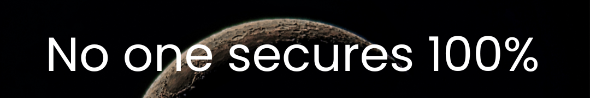

<h3 style="font-size: 24px;"><i></i></h3>

  </h4>
    <ul style="list-style-type: none; padding: 0;">
 

    <li>💬 Ask me about <strong>Burp suite, Nessus, Owasp Zap, Kali Linux, Cryptography, Ethical Hacking, Python Scripting, Penetration Testing, Red Team Engineer</strong></li>
    <li>📫 How to reach me: <a href="mailto:safimohmand34@gmail.com" style="color: #007bff; text-decoration: none;"><strong>safinfosec@gmail.com</strong></a></li>
  </ul>
   
  
  
    

  

 

